Figures paper Lake Hillier
================
Maria Sierra
8/3/2022

``` r
library(phyloseq)
library(tidyr)
library(ggplot2)
library(ggpubr)
library(dplyr)
library(plyr)
library(ggtree)
library(pheatmap)
library(data.table)
library(treeio)
library(tibble)
library(devtools)
library(stringr)
library(RColorBrewer)
library(VennDiagram)
library(ALDEx2)
library(phytools)
library(eulerr)
library(ggtree)
library(forcats)
library(taxize)
library(VennDiagram)
library(RColorBrewer)
```

``` r
#Amplicon data
#16s data
OTUs_16S=read.table("table.from_biom.txt", header = T,sep="\t",stringsAsFactors = F) #Biom table from qiime2 needs to be open on a text editor since qiime2 includes extra first rows that need to be removed
OTUs_16S=t(OTUs_16S) #Make OTUs the columns
colnames(OTUs_16S) <- OTUs_16S[1,] 
OTUs_16S <- OTUs_16S[-1, ] 
class(OTUs_16S) <- "numeric"

tax_16s=read.table("taxonomy.tsv", header = T,sep="\t") #Taxonomy table from qiime2
row.names(tax_16s) = tax_16s$FeatureID #Make OTUs the rownames
tax_16s=tax_16s[,-1]
tax.clean = separate(tax_16s, Taxon, into = c("Domain", "Phylum", "Class", "Order", "Family", "Genus", "Species"), sep=";")
tax.clean = tax.clean[,-which(names(tax.clean) %in% c("Confidence"))]

otu_uf_16s = otu_table(OTUs_16S, taxa_are_rows=F)
tax_uf_16s = tax_table(as.matrix(tax.clean))

metadata_16s = read.table("metadata-all.txt", header=TRUE,  sep="\t", dec = ".") #Sample names MUST be the same in both files, otherwise is not going to pair data 
rownames(metadata_16s) <- metadata_16s[,1] 
meta_16s<-sample_data(metadata_16s)
physeq = phyloseq(otu_uf_16s,tax_uf_16s, meta_16s)
hillier_phylo_16s <- merge_phyloseq (otu_uf_16s,tax_uf_16s, meta_16s)


#18s data
OTUs_18S=read.table("qiime_18S_1391f_EukBr/otu_biom_18s.txt", header = T,sep="\t",stringsAsFactors = F) #Biom table from qiime2 needs to be open on a text editor because it contains an extra first row
OTUs_18S=t(OTUs_18S) #Make OTUs the columns
colnames(OTUs_18S) <- OTUs_18S[1,] 
OTUs_18S <- OTUs_18S[-1, ] 
class(OTUs_18S) <- "numeric"

tax_18s=read.table("qiime_18S_1391f_EukBr/taxonomy_18s.tsv", header = T,sep="\t")
row.names(tax_18s) = tax_18s$Feature.ID
tax_18s=tax_18s[,-1]
tax.clean = separate(tax_18s, Taxon, into = c("Domain", "Phylum", "Class", "Order", "Family", "Genus", "Species"), sep=";")
tax.clean = tax.clean[,-which(names(tax.clean) %in% c("Confidence"))]

otu_uf_18s = otu_table(OTUs_18S, taxa_are_rows=F)
tax_uf_18s = tax_table(as.matrix(tax.clean))

metadata_18s = read.table("qiime_18S_1391f_EukBr/metadata.txt", header=TRUE,  sep="\t", dec = ".") #Sample names MUST be the same in both files, otherwise is going not going to pair data 
rownames(metadata_18s) <- metadata_18s[,1] 
meta_18s<-sample_data(metadata_18s)

physeq = phyloseq(otu_uf_18s,tax_uf_18s)
hillier_phylo_18S <- merge_phyloseq (otu_uf_18s,tax_uf_18s, meta_18s)
hillier_phylo_18S= subset_samples(hillier_phylo_18S, Collection !="cntl")

#wgs data

DSF3=read.table("DS-F3_bracken_species_v2.kreport.parsed.out", header = T,sep="\t",stringsAsFactors = F, fill = T) #Biom table from qiime2 needs to be open on a text editor because it contains an extra first row
DSF3_domain=DSF3[DSF3$rank=="D",]
DSF3_domain$Type= "Sed"

FWF3=read.table("FW-F3_bracken_species_v2.kreport.parsed.out", header = T,sep="\t",stringsAsFactors = F, fill = T) #Biom table from qiime2 needs to be open on a text editor because it contains an extra first row
FWF3_domain=FWF3[FWF3$rank=="D",]
FWF3_domain$Type= "Water"

merged_data_domain_wgs=rbind(DSF3_domain,FWF3_domain)
merged_data_domain_wgs=dplyr::select(merged_data_domain_wgs, TaxonName, Reads, Type)
merged_data_domain_wgs$Target="WGS"
colnames(merged_data_domain_wgs)=c("Domain", "Abundance", "Type", "Target")
```

### Figure 1

1.  Diversity by Domain

<!-- end list -->

``` r
g18s_plot=plot_bar(hillier_phylo_18S, fill="Domain")
g18s_plot_data=as.data.frame(g18s_plot$data)

g16s_plot=plot_bar(hillier_phylo_16s, fill="Domain")
g16s_plot_data=as.data.frame(g16s_plot$data)

merged_data_domain_amplicon=rbind(g16s_plot_data,g18s_plot_data) #merge 18s and 16s dataframes
merged_data_domain_amplicon=dplyr::select(merged_data_domain_amplicon, Abundance, Domain, Type, Target )

merged_data_domain_amplicon_summarized=merged_data_domain_amplicon %>%
  group_by(Domain, Type, Target) %>% 
  summarise_each(funs(sum))  #Merge by Domain adding abundances
```

    ## Warning: `summarise_each_()` was deprecated in dplyr 0.7.0.
    ## Please use `across()` instead.
    ## This warning is displayed once every 8 hours.
    ## Call `lifecycle::last_lifecycle_warnings()` to see where this warning was generated.

    ## Warning: `funs()` was deprecated in dplyr 0.8.0.
    ## Please use a list of either functions or lambdas: 
    ## 
    ##   # Simple named list: 
    ##   list(mean = mean, median = median)
    ## 
    ##   # Auto named with `tibble::lst()`: 
    ##   tibble::lst(mean, median)
    ## 
    ##   # Using lambdas
    ##   list(~ mean(., trim = .2), ~ median(., na.rm = TRUE))
    ## This warning is displayed once every 8 hours.
    ## Call `lifecycle::last_lifecycle_warnings()` to see where this warning was generated.

``` r
data_domain_amplicon_summarized_clean=lapply(as.data.frame(merged_data_domain_amplicon_summarized), function(x) sub("d__", "", x)) #Clean domain names
data_domain_amplicon_summarized_clean=as.data.frame(data_domain_amplicon_summarized_clean)
data_domain_amplicon_filtered= data_domain_amplicon_summarized_clean[data_domain_amplicon_summarized_clean$Domain !="Unassigned",]
data_domain_amplicon_filtered= data_domain_amplicon_filtered[data_domain_amplicon_filtered$Abundance !="0",]


domain_data=rbind(data_domain_amplicon_filtered, merged_data_domain_wgs)
domain_data$Abundance=as.numeric(domain_data$Abundance)

domain_data$Scale = scale(as.numeric(domain_data$Abundance)) #Scale data
domain_data$Z.score <- (domain_data$Abundance - mean(domain_data$Abundance)) / sd(domain_data$Abundance)
domain_data$Norm <- (domain_data$Abundance - min(domain_data$Abundance)) / (max(domain_data$Abundance) - min(domain_data$Abundance))
domain_data$log <- log(domain_data$Abundance)
domain_data$Target <- factor(domain_data$Target,      # Reordering group factor levels
                         levels = c("16S", "A2F", "18S", "WGS"))


ggplot(domain_data, aes(x= Type, y= Domain))+geom_point(aes(color= Domain, size=log)) + facet_grid(~Target,scales = "free_x")  + scale_color_manual(values = c("orange", "deepskyblue3", "#AFE185", "#D82C2C")) + theme_bw()
```

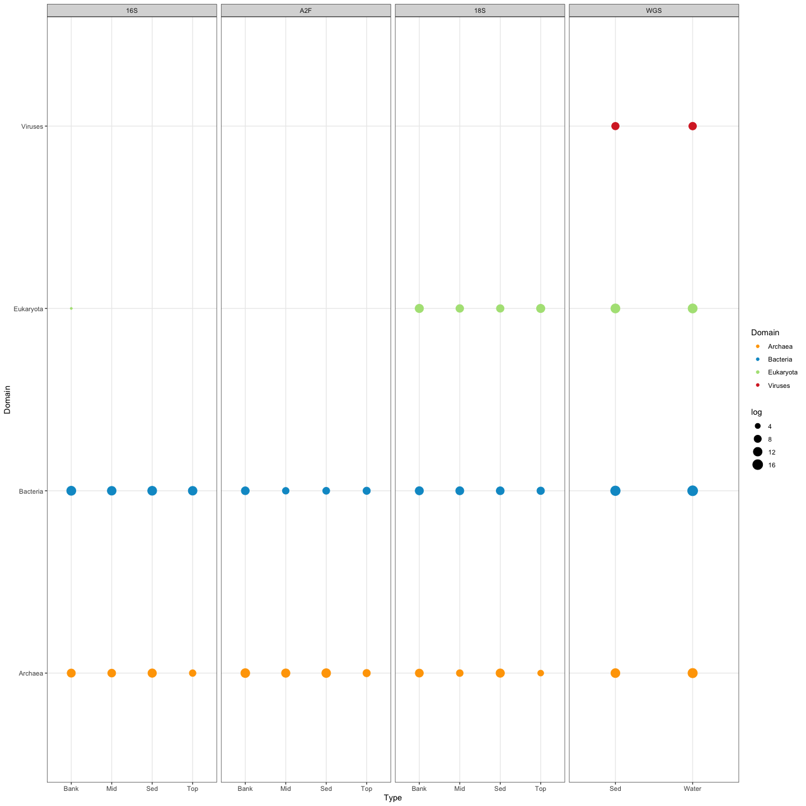<!-- -->

### Figure 1

2.  Shared species between methods

<!-- end list -->

``` r
g18s_plot=plot_bar(hillier_phylo_18S, fill="Species")
g18s_plot_data=as.data.frame(g18s_plot$data)

g16s_plot=plot_bar(hillier_phylo_16s, fill="Species")
g16s_plot_data=as.data.frame(g16s_plot$data)

merged_data_species_amplicon=rbind(g16s_plot_data,g18s_plot_data) #merge 18s and 16s dataframes
merged_data_species_amplicon=dplyr::select(merged_data_species_amplicon, Abundance, Domain,Species, Type, Target )

merged_data_species_amplicon_summarized=merged_data_species_amplicon %>%
  group_by(Domain,Species, Type, Target) %>% 
  summarise_each(funs(sum))  #Merge by species adding abundances

data_domain_species_summarized_clean=lapply(as.data.frame(merged_data_species_amplicon_summarized), function(x) sub("s__", "", x)) #Clean domain names
data_domain_species_summarized_clean=lapply(as.data.frame(data_domain_species_summarized_clean), function(x) sub("d__", "", x)) #Clean domain names
data_domain_species_summarized_clean=as.data.frame(data_domain_species_summarized_clean)

data_domain_species_filtered=data_domain_species_summarized_clean[!grepl('Unassigned|unidentified', data_domain_species_summarized_clean$Species),]
data_domain_species_filtered= data_domain_species_filtered[data_domain_species_filtered$Abundance !="0",] #Remove species with zero abundance

DSF3_sp=DSF3[DSF3$rank=="S",] #get wgs at species level
DSF3_sp$Type= "Sed"

FWF3_sp=FWF3[FWF3$rank=="S",]
FWF3_sp$Type= "Water"

merged_data_species_wgs=rbind(DSF3_sp,FWF3_sp) #Bind both samples from wgs
merged_data_species_wgs=dplyr::select(merged_data_species_wgs, Taxon, TaxonName, Reads, Type) #Select desired columns
merged_data_species_wgs$Taxon= gsub("\\|.*", "",merged_data_species_wgs$Taxon)
merged_data_species_wgs$Taxon= sub("d__", "",merged_data_species_wgs$Taxon)
merged_data_species_wgs$Target="WGS"
colnames(merged_data_species_wgs)=c("Domain","Species", "Abundance", "Type", "Target") #Change column names to match with amplicon table

species_data=rbind(data_domain_species_filtered, merged_data_species_wgs) #Bind amplicon and wgs data

#Venn bacteria
species_data_bacteria=species_data[species_data$Domain=="Bacteria",] #Trim bacteria
species_data_bacteria$Species= sub(" ", "_", str_trim(species_data_bacteria$Species)) #Clean names
species_data_bacteria$Target=sub("16S|18S|A2F", "Amplicon",  species_data_bacteria$Target) #Merge amplicon genes on a single "amplicon" category
species_data_bacteria_filtered=dplyr::select(species_data_bacteria, Species, Target, Abundance)
species_data_bacteria_filtered$Abundance=as.numeric(species_data_bacteria_filtered$Abundance)

species_bacteria_pres=xtabs(Abundance~Species+Target, species_data_bacteria_filtered) #Construct frequency table
species_bacteria_pres_matrix=as.data.frame.matrix(species_bacteria_pres)

only_bac=species_bacteria_pres_matrix[species_bacteria_pres_matrix$WGS>0,]

draw.pairwise.venn(area1=nrow(species_bacteria_pres_matrix[species_bacteria_pres_matrix$Amplicon>0,]),area2=nrow(species_bacteria_pres_matrix[species_bacteria_pres_matrix$WGS>0,]),cross.area=nrow(species_bacteria_pres_matrix[species_bacteria_pres_matrix$Amplicon>0 & species_bacteria_pres_matrix$WGS> 0,]), category=c("Amplicon","WGS"),fill=c("lightskyblue1","deepskyblue3"), alpha = 0.8, cex = 5, cat.pos = 10)
```

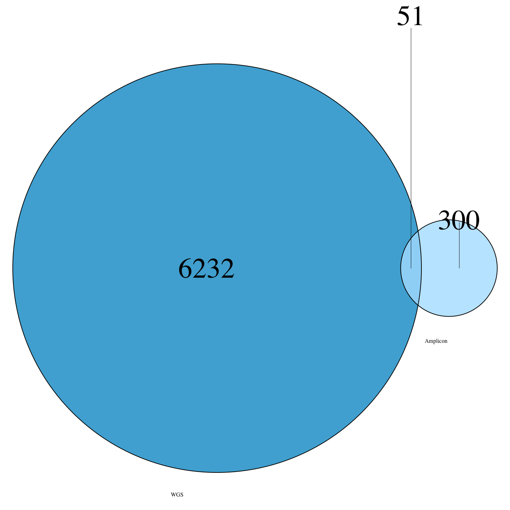<!-- -->

    ## (polygon[GRID.polygon.213], polygon[GRID.polygon.214], polygon[GRID.polygon.215], polygon[GRID.polygon.216], text[GRID.text.217], text[GRID.text.218], lines[GRID.lines.219], text[GRID.text.220], lines[GRID.lines.221], text[GRID.text.222], text[GRID.text.223])

``` r
#Bacteria found in both methods
species_bacteria_pres_matrix_overlap=species_bacteria_pres_matrix[species_bacteria_pres_matrix$Amplicon > 0 & species_bacteria_pres_matrix$WGS > 0,]
species_bacteria_pres_matrix_overlap$Ampl_norm <- log(species_bacteria_pres_matrix_overlap$Amplicon)
species_bacteria_pres_matrix_overlap$wgs_norm <- log(species_bacteria_pres_matrix_overlap$WGS)
species_bacteria_pres_matrix_overlap$Species=rownames(species_bacteria_pres_matrix_overlap)

DFtall_bac <- species_bacteria_pres_matrix_overlap %>% gather(key = all_abundance, value = Value, Ampl_norm:wgs_norm)
my_blues = brewer.pal(n = 9, "Blues")[3:9] 

ggplot(data=DFtall_bac, aes(x=Species, y=Value, fill=all_abundance))+ coord_flip()+
  geom_col(position = "dodge")+ theme_bw() + xlab("Species") + ylab("Log. Abundance")+ ggtitle("Bacteria overlap") + guides(fill=guide_legend("Method")) + 
  scale_fill_manual(values=c("lightskyblue1","deepskyblue3"),labels = c("Amplicon", "WGS")) 
```

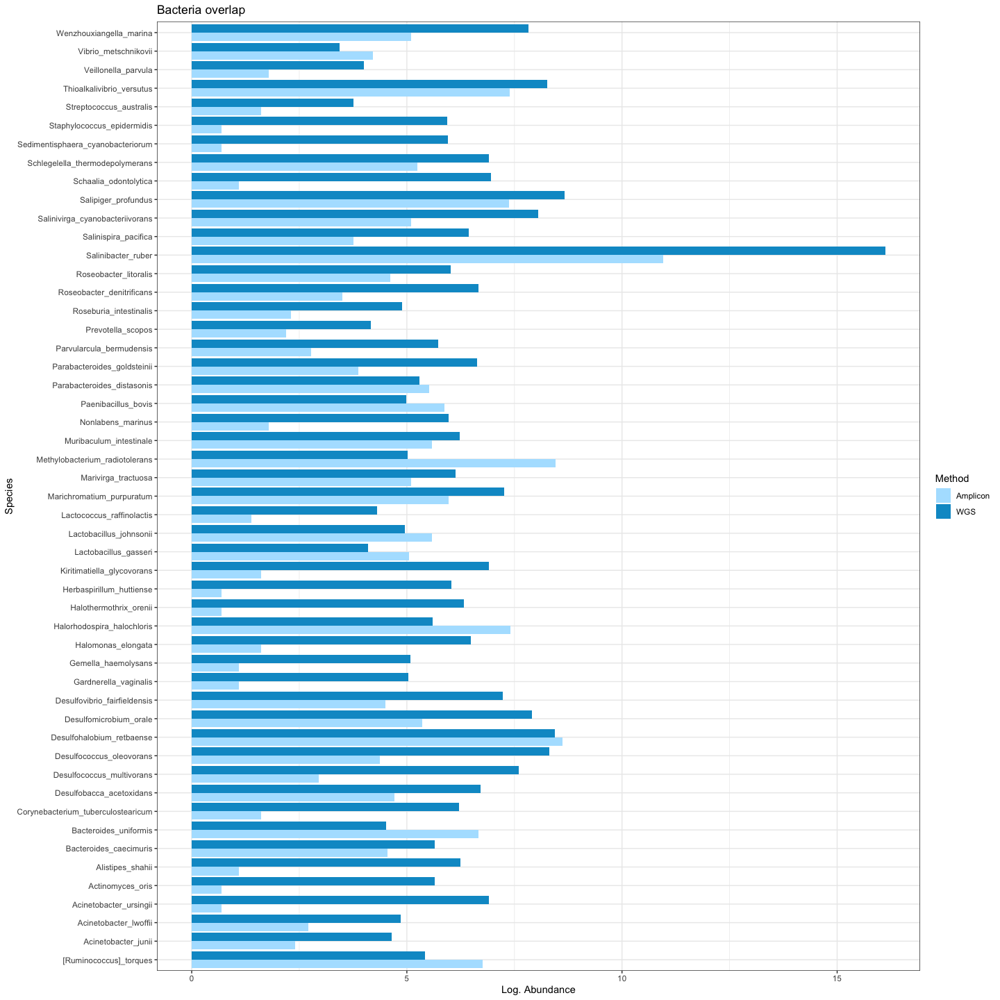<!-- -->

``` r
#Venn archaea
species_data_arch=species_data[species_data$Domain=="Archaea",]
species_data_arch$Species= sub(" ", "_", str_trim(species_data_arch$Species))
species_data_arch$Target=sub("16S|18S|A2F", "Amplicon",  species_data_arch$Target)
species_data_arch_filtered=dplyr::select(species_data_arch, Species, Target, Abundance)
species_data_arch_filtered$Abundance=as.numeric(species_data_arch_filtered$Abundance)

species_arch_pres=xtabs(Abundance~Species+Target, species_data_arch_filtered)
species_arch_pres_matrix=as.data.frame.matrix(species_arch_pres)

draw.pairwise.venn(area1=nrow(species_arch_pres_matrix[species_arch_pres_matrix$Amplicon>0,]),
                   area2=nrow(species_arch_pres_matrix[species_arch_pres_matrix$WGS>0,]),
                   cross.area=nrow(species_arch_pres_matrix[species_arch_pres_matrix$Amplicon>0 & species_arch_pres_matrix$WGS> 0,]),
                   category=c("Amplicon","WGS"),fill=c("#F9EDC2","#F7C25E"), alpha = 0.8, cex = 5, cat.pos = 10)
```

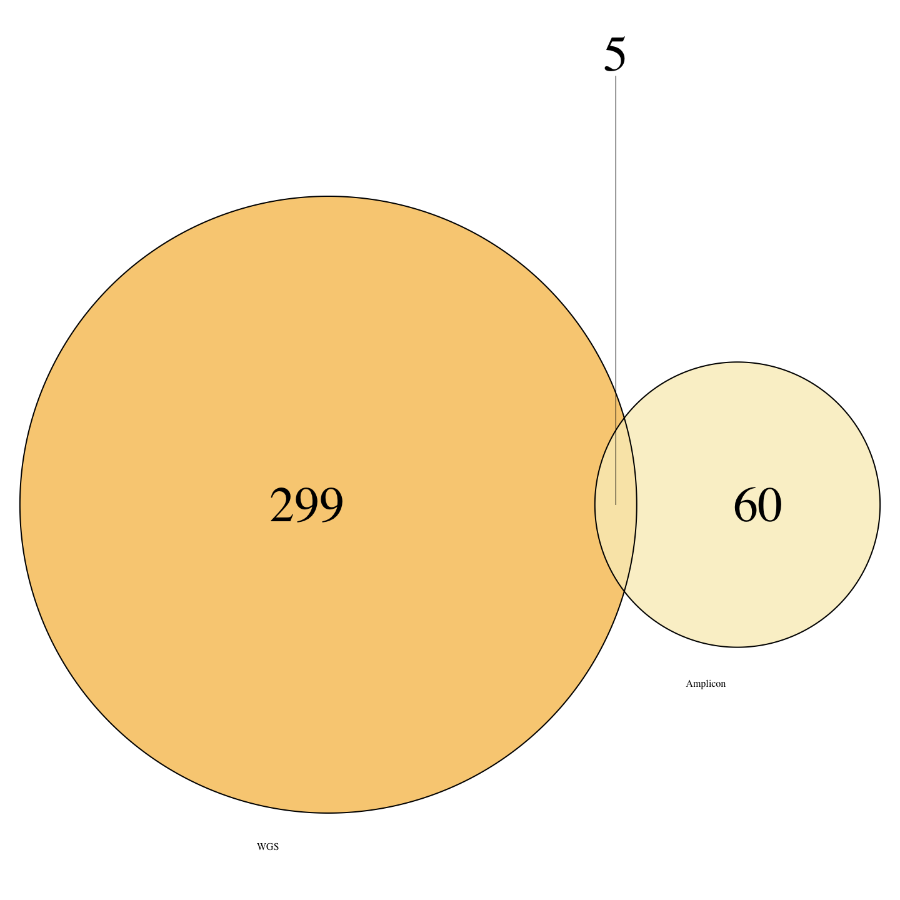<!-- -->

    ## (polygon[GRID.polygon.283], polygon[GRID.polygon.284], polygon[GRID.polygon.285], polygon[GRID.polygon.286], text[GRID.text.287], text[GRID.text.288], text[GRID.text.289], lines[GRID.lines.290], text[GRID.text.291], text[GRID.text.292])

``` r
#Overlap taxa abundance

#Archaea found in both methods
species_arch_pres_matrix_overlap=species_arch_pres_matrix[species_arch_pres_matrix$Amplicon > 0 & species_arch_pres_matrix$WGS > 0,]
species_arch_pres_matrix_overlap$Ampl_norm <- log(species_arch_pres_matrix_overlap$Amplicon)
species_arch_pres_matrix_overlap$wgs_norm <- log(species_arch_pres_matrix_overlap$WGS)
species_arch_pres_matrix_overlap$Species=rownames(species_arch_pres_matrix_overlap)

DFtall <- species_arch_pres_matrix_overlap %>% gather(key = all_abundance, value = Value, Ampl_norm:wgs_norm)
my_blues = brewer.pal(n = 9, "Blues")[3:9] 

ggplot(data=DFtall, aes(x=Species, y=Value, fill=all_abundance))+ coord_flip()+
 geom_col(position = "dodge")+ theme_bw() + xlab("Species") + ylab("Log. Abundance")+ ggtitle("Archaea overlap") + guides(fill=guide_legend("Method")) + 
  scale_fill_manual(values=c("#F9EDC2","#F7C25E"),labels = c("Amplicon", "WGS")) 
```

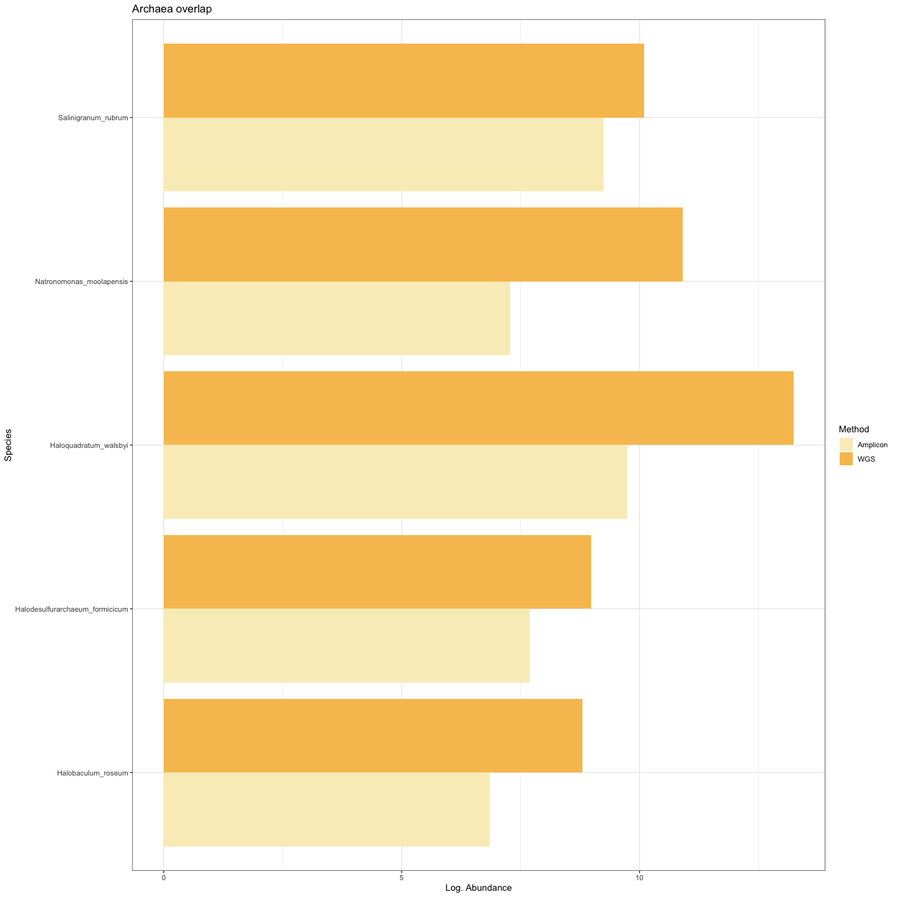<!-- -->

``` r
#Venn Eukaryota
species_data_euk=species_data[species_data$Domain=="Eukaryota",]
species_data_euk$Species= sub(" ", "_", str_trim(species_data_euk$Species))
species_data_euk$Target=sub("16S|18S|A2F", "Amplicon",  species_data_euk$Target)
species_data_euk_filtered=dplyr::select(species_data_euk, Species, Target, Abundance)
species_data_euk_filtered$Abundance=as.numeric(species_data_euk_filtered$Abundance)

species_euk_pres=xtabs(Abundance~Species+Target, species_data_euk_filtered)
species_euk_pres_matrix=as.data.frame.matrix(species_euk_pres)

draw.pairwise.venn(area1=nrow(species_euk_pres_matrix[species_euk_pres_matrix$Amplicon>0,]),
                   area2=nrow(species_euk_pres_matrix[species_euk_pres_matrix$WGS>0,]),
                   cross.area=nrow(species_euk_pres_matrix[species_euk_pres_matrix$Amplicon>0 & species_euk_pres_matrix$WGS> 0,]),
                   category=c("Amplicon","WGS"),fill=c("#A1D99B","#006D2C"), alpha = 0.8, cex = 5, cat.pos = 10)
```

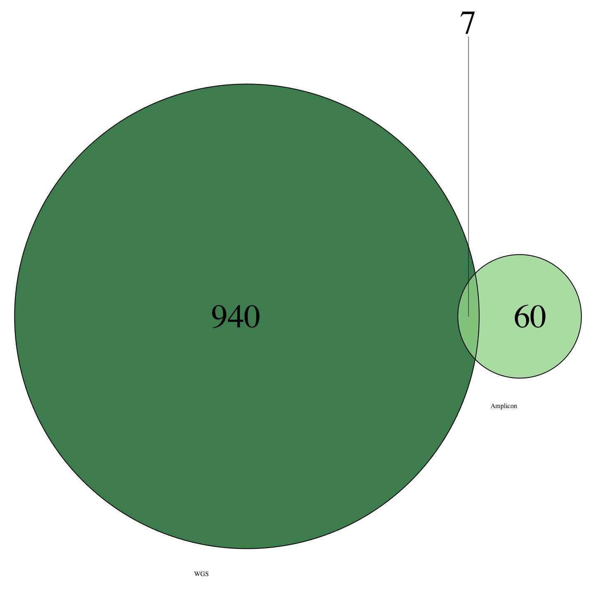<!-- -->

    ## (polygon[GRID.polygon.351], polygon[GRID.polygon.352], polygon[GRID.polygon.353], polygon[GRID.polygon.354], text[GRID.text.355], text[GRID.text.356], text[GRID.text.357], lines[GRID.lines.358], text[GRID.text.359], text[GRID.text.360])

``` r
#Eukarya in both methods

species_euk_pres_matrix_overlap=species_euk_pres_matrix[species_euk_pres_matrix$Amplicon > 0 & species_euk_pres_matrix$WGS > 0,]
species_euk_pres_matrix_overlap$Ampl_norm <- log(species_euk_pres_matrix_overlap$Amplicon)
species_euk_pres_matrix_overlap$wgs_norm <- log(species_euk_pres_matrix_overlap$WGS)
species_euk_pres_matrix_overlap$Species=rownames(species_euk_pres_matrix_overlap)

DFtall_bac <- species_euk_pres_matrix_overlap %>% gather(key = all_abundance, value = Value, Ampl_norm:wgs_norm)
my_greens = brewer.pal(n = 9, "Greens")[3:9] 


ggplot(data=DFtall_bac, aes(x=Species, y=Value, fill=all_abundance))+ coord_flip()+
  geom_col(position = "dodge")+ theme_bw() + xlab("Species") + ylab("Log. Abundance")+ ggtitle("Eukaryota overlap") + guides(fill=guide_legend("Method")) + 
  scale_fill_manual(values=c("#A1D99B","#006D2C"),labels = c("Amplicon", "WGS")) 
```

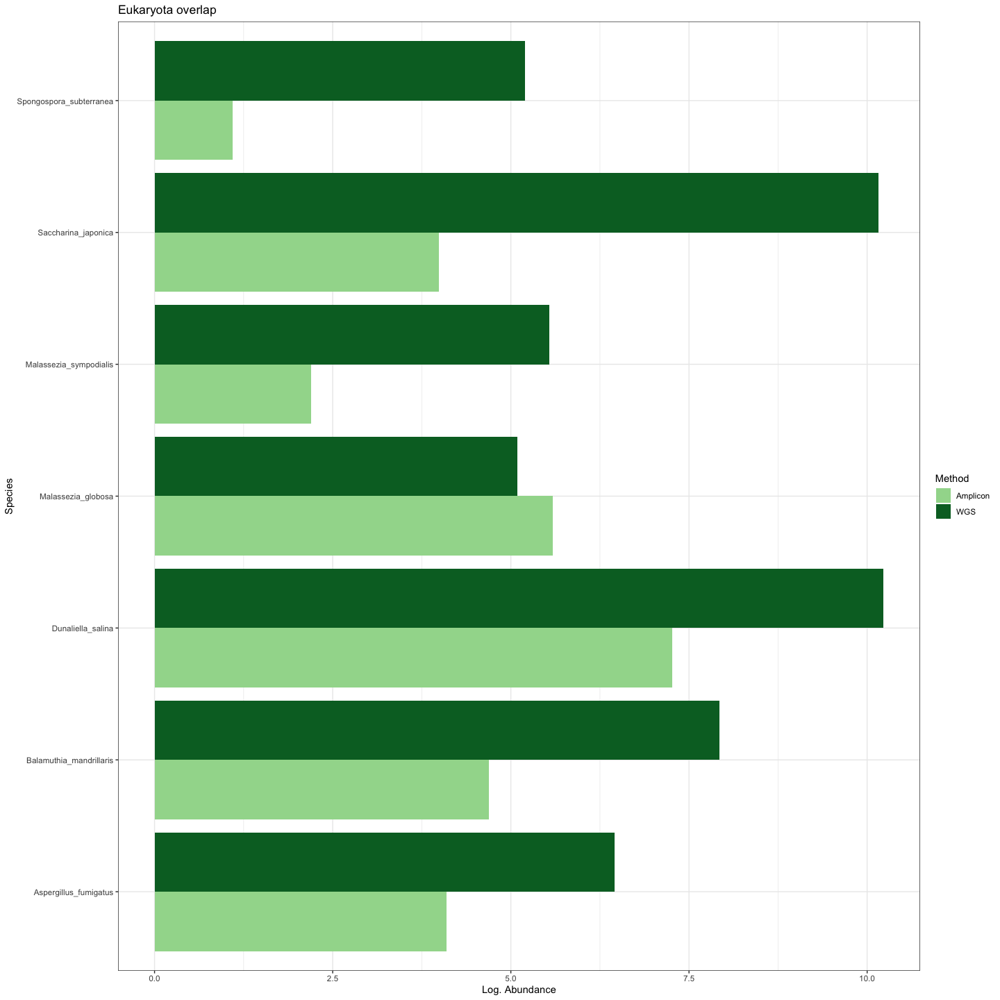<!-- -->

### Figure 1

3.  Differential abundance of genera in different types of sample (bank,
    mid, sed, top)

<!-- end list -->

``` r
g18s_plot=plot_bar(hillier_phylo_18S, fill="Genus")
g18s_plot_data=as.data.frame(g18s_plot$data)
g16s_plot=plot_bar(hillier_phylo_16s, fill="Genus")
g16s_plot_data=as.data.frame(g16s_plot$data)

merged_data_genus_amplicon=rbind(g16s_plot_data,g18s_plot_data) #merge 18s and 16s dataframes
merged_data_genus_amplicon=dplyr::select(merged_data_genus_amplicon,Sample, Abundance,Genus, Type)

merged_data_genus_amplicon_summarized=merged_data_genus_amplicon %>%
  group_by(Sample, Genus, Type) %>% 
  summarise_each(funs(sum))  #Merge by species adding abundances

data_genus_summarized_clean=lapply(as.data.frame(merged_data_genus_amplicon_summarized), function(x) sub("g__", "", x)) #Clean genus names
data_genus_summarized_clean=lapply(as.data.frame(data_genus_summarized_clean), function(x) sub("d__", "", x)) #Clean domain names
data_genus_summarized_clean=as.data.frame(data_genus_summarized_clean)

#Remove unclassified species
data_genus_summarized_filtered=data_genus_summarized_clean[!grepl('Unassigned|unidentified', data_genus_summarized_clean$Genus),]
data_genus_summarized_filtered= data_genus_summarized_filtered[data_genus_summarized_filtered$Abundance !="0",] #Remove species with zero abundance

DSF3_gen=DSF3[DSF3$rank=="G",] #get wgs at genus level
DSF3_gen$Type= "Sed"
DSF3_gen$Sample= "DSF3_WGS"

FWF3_gen=FWF3[FWF3$rank=="G",]
FWF3_gen$Type= "Water"
FWF3_gen$Sample= "FWF3_WGS"

merged_data_genus_wgs=rbind(DSF3_gen,FWF3_gen) #Bind both samples from wgs
merged_data_genus_wgs=dplyr::select(merged_data_genus_wgs, Sample, TaxonName, Reads, Type) #Select desired columns
colnames(merged_data_genus_wgs)=c("Sample","Genus", "Abundance", "Type") #Change column names to match with amplicon table

genus_data=rbind(data_genus_summarized_filtered, merged_data_genus_wgs) #Bind amplicon and wgs data
genus_data_order=genus_data[order(genus_data[["Type"]]),]
genus_data_order$Type=as.factor(genus_data_order$Type)
genus_data_order$Abundance=as.numeric(genus_data_order$Abundance)

genus_data_order_table=as.data.frame.matrix(xtabs(Abundance~Genus+Sample, genus_data_order)) #Construct frequency table
genus_data_order_table = genus_data_order_table[,unique(genus_data_order$Sample)] #Reorder columns based on type group

conds <- c(rep("Bank",20),rep("Mid",12),rep("Sed",21), rep("Top", 12),"Water" ) #Set categories for ALDEx2
x<- aldex.clr(genus_data_order_table, conds, denom = "all")
x.al <- aldex.kw(x)
genus_significant = x.al[which(x.al$kw.ep < 0.05),] #OTUs with p<0.05  #glm ANOVA

genus_significant$Genus <- rownames(genus_significant)
genus_significant_abun <- subset(genus_data_order_table, subset=rownames(genus_data_order_table) %in% genus_significant$Genus) #Extract Taxonomy for ALDEx2 OTUs
rownames(genus_significant_abun) =str_trim(rownames(genus_significant_abun))

genus_taxa=rownames(genus_significant_abun) #Get taxa names 
gen_clas=classification(genus_taxa, db= 'ncbi')  #Get taxonomy of taxa. We only want to keep taxa at classified Genus level
gen_clas_clean=gen_clas[!is.na(gen_clas)] #Keep taxa that have ncbi taxonomy
gen_clas_del=names(gen_clas[is.na(gen_clas)]) #Check ommitted taxa. Manually inspected to avoid missing genera.
# Acethothermiia Bathyarchaeia were ommitted from NCBI but are present in SILVA database. Will include these genera manually in the final list.
list_of_genus=c()  #get genera names of list where column rank contains 'genus'
for (x in gen_clas_clean){
  table1=as.data.frame(x)
  if("genus" %in% table1$rank){
  genus=tail(table1$name, 1)
  list_of_genus=append(list_of_genus,genus)
  }}
list_of_genus=append(list_of_genus, c("Acethothermiia" ,"Bathyarchaeia" ))
genus_significant_abun_trim=genus_significant_abun[rownames(genus_significant_abun) %in% list_of_genus,]
genus_significant_abun_norm <- microbiome::transform(genus_significant_abun_trim, "log")

Sample=names(genus_significant_abun_norm)
Type=conds
Preservation=sub("\\_.*", "", Sample)
metadata_genus=data.frame(Sample, Type, Preservation)
rownames(metadata_genus)=metadata_genus$Sample
metadata_genus=metadata_genus[-1]

Type = c(Bank = "khaki", Mid="darkorange", Sed="coral2", Top="red3", Water="red4")
Preservation=c(DMSO="#DEEBF7", EtOH="#B6D0E2", FROZ="#87CEEB", DSF3="#4682B4", FWF3="#08306B")
colorspal = list(Type=Type, Preservation=Preservation)
col.pal <- RColorBrewer::brewer.pal(9, "BuPu")

pheatmap(as.matrix(genus_significant_abun_norm),fontsize_row=13, scale = "none", color = col.pal,labels_col = "",
         cluster_cols = F, clusterrows = T, annotation_col = metadata_genus, 
         annotation_colors = colorspal) + scale_fill_brewer(palette = "BrBG") 
```

## Supplemental Figure 6

Species only present in certain sample type (water vs sed vs bank)

``` r
species_data$Type=as.factor(species_data$Type)
species_data$Abundance=as.numeric(species_data$Abundance)
species_data$Species=str_trim(species_data$Species)

species_data_unique=species_data
species_data_unique$Type=sub("Top|Mid|Water", "Water",  species_data_unique$Type)
species_data_unique=dplyr::select(species_data_unique, Domain, Species, Type, Abundance)

species_data_unique_pres=xtabs(Abundance~Species+Type, species_data_unique)
species_data_unique_matrix=as.data.frame.matrix(species_data_unique_pres)

in_water=species_data_unique_matrix[species_data_unique_matrix$Water>0 & species_data_unique_matrix$Sed==0 & species_data_unique_matrix$Bank==0,]

in_bank=species_data_unique_matrix[species_data_unique_matrix$Bank>0 & species_data_unique_matrix$Sed==0 & species_data_unique_matrix$Water==0  ,]

in_sed= species_data_unique_matrix[species_data_unique_matrix$Sed>0& species_data_unique_matrix$Water==0 & species_data_unique_matrix$Water==0 ,]


VennDiag <- euler(c("Water" = nrow(in_water), 
                    "Bank" = nrow(in_bank), 
                    "Sediment" = nrow(in_sed), 
                    "Water&Bank"=length(intersect(species_data_unique_matrix$Water,species_data_unique_matrix$Bank)),
                    "Bank&Sediment" = length(intersect(species_data_unique_matrix$Bank, species_data_unique_matrix$Sed)), 
                    "Water&Sediment" = length(intersect(species_data_unique_matrix$Water, species_data_unique_matrix$Sed)), 
                    "Water&Bank&Sediment" = nrow(species_data_unique_matrix[species_data_unique_matrix$Bank>0 & species_data_unique_matrix$Sed> 0 & species_data_unique_matrix$Water> 0,])),shape = "ellipse" )

plot(VennDiag, quantities = TRUE,  labels = list(font = 2, cex=2),alpha=0.5, 
     fill= c("coral2", "khaki", "red4"))
```

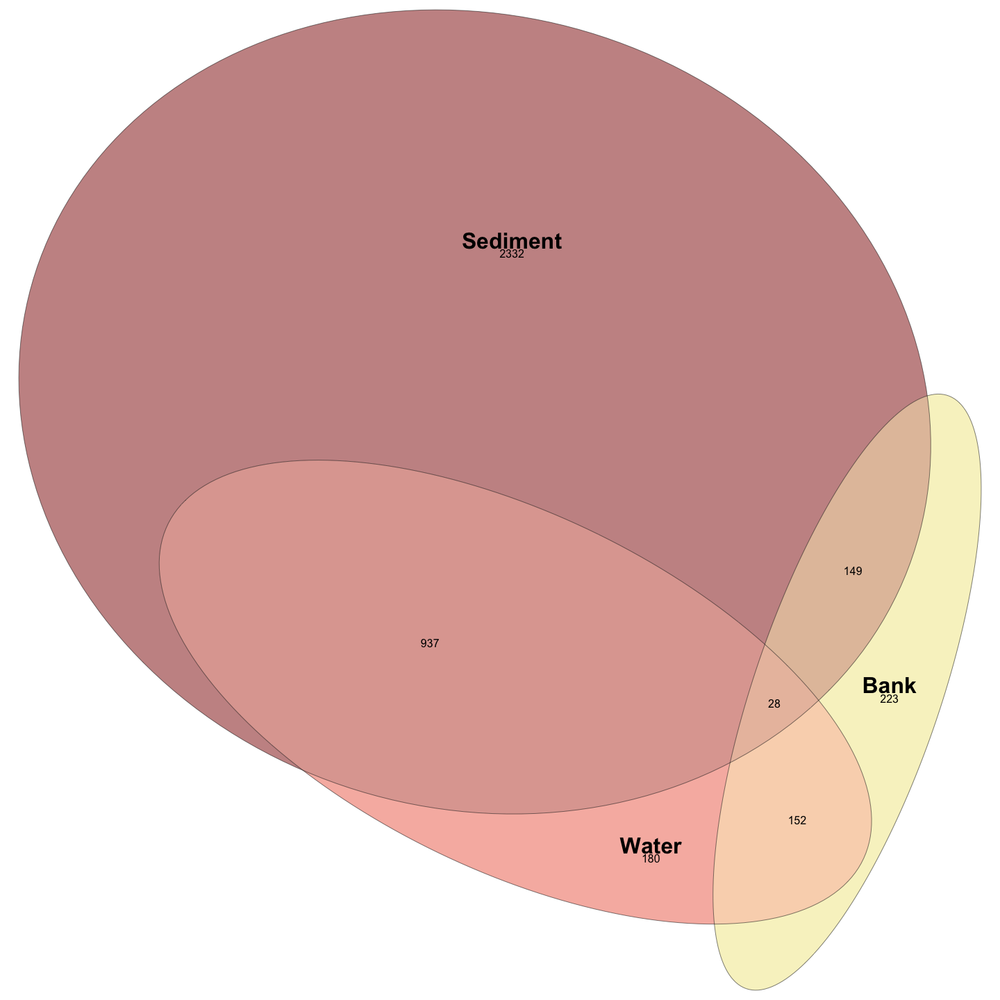<!-- -->

### Figure 1

4.  Core species (species present in all sample types)

<!-- end list -->

``` r
#Core species (species present in all sample types)
core_species=species_data_unique_matrix[species_data_unique_matrix$Bank>0 & species_data_unique_matrix$Sed> 0 &
                             species_data_unique_matrix$Water> 0,]
core_species_ord=core_species[order(core_species$Bank, core_species$Sed, core_species$Water, decreasing = T),]
core_species_ord_clean=core_species_ord[!grepl('Unassigned|unidentified|uncultured|ZSS|metagenome', row.names(core_species_ord)),]

Species=rep(rownames(core_species_ord_clean),3)
Type=c(rep("Bank",length(rownames(core_species_ord_clean))),rep("Sed",length(rownames(core_species_ord_clean))),
       rep("Water",length(rownames(core_species_ord_clean))))
Abundance=c(core_species_ord_clean$Bank, core_species_ord_clean$Sed, core_species_ord_clean$Water)
core_species_ord_clean_df=data.frame(Species, Type, Abundance)

ggplot(core_species_ord_clean_df, aes(x= Type, y= Species))+geom_point(aes(color= Type, size=log(Abundance))) + coord_flip()+
  scale_size(range = c(1,15))  + scale_color_manual(values = c("khaki", "red4", "coral2")) + theme_bw()
```

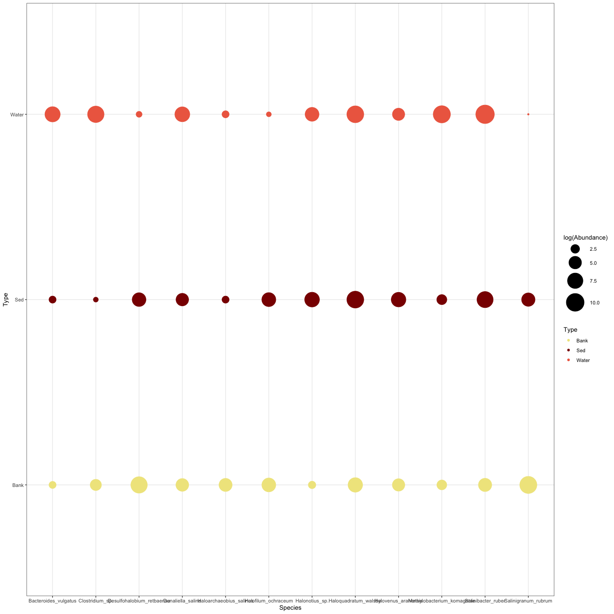<!-- -->

### Figure 3

Extremophile tree

``` r
#Get extremophile data from TMD and Halospecies 
tmd_data_v24=read.table("tmd_data_v24.txt")
tmd_xmp=tmd_data_v24[grepl('Yes', tmd_data_v24$extremophile),]#tmd_data_v24 from TMD curation data
halo_microbes=read.csv("/Users/mas4037/Dropbox (Mason Lab)/Microbe Directory 2.0/Halospecies_copy.csv", na.strings = F)

tmd_xmp_total=full_join(tmd_xmp, halo_microbes)
```

    ## Joining, by = c("scientific_name", "extremophile", "extremophile_type")

``` r
tmd_xmp_total_trim=tmd_xmp_total %>% dplyr::select(scientific_name, microbiome, microbiome_extreme, euk_pigmentation, euk_pigmentation_type,extremophile,extremophile_type,metabolism,biofilm_forming,bac_oxygen_use) #Select only desired columns
species_data_xmp=species_data
species_data_xmp$Species= sub("_", " ",species_data_xmp$Species)
colnames(species_data_xmp)=c("Domain", "scientific_name", "Type", "Target", "Abundance") #Change species colname to scientific name to match with tmd table
hillier_xmp=inner_join(species_data_xmp, tmd_xmp_total_trim, by="scientific_name") #Keep tmd data for those extremophiles found in hillier
hillier_xmp[hillier_xmp == "Unknown" ] <- NA #Convert unknown to NA
for (i in 1:14){
  hillier_xmp[which(is.na(hillier_xmp[,i])),i] = ""
} #Remove NAs and replace with empty strings

hillier_xmp_sum=hillier_xmp %>% 
  group_by(Domain, scientific_name, Type, Target) %>% 
  summarise_all(funs(trimws(paste(unique(.), collapse = " ")))) #Merge taxa that appeared duplicated in tmd
hillier_xmp_sum_df=as.data.frame(hillier_xmp_sum)

lev=levels(factor(hillier_xmp_sum_df$extremophile_type))#Split extremophile type column
lev=unique(unlist(strsplit(lev, " "))) #unique types levels of extremophiles
#mnames <- gsub(" ", "_", paste("xmp", lev, sep = "."))
result_extreme <- matrix(data = "", nrow = length(hillier_xmp_sum_df$extremophile_type), ncol = length(lev)) #create empty matrix with df dimentions
char.var = hillier_xmp_sum_df$extremophile_type

for (i in 1:length(lev)) {
  result_extreme[grep(lev[i], char.var, fixed = F), i] <- "Present"
} #Presence matrix for each extremophile type
result_extreme <- data.frame(result_extreme, stringsAsFactors = TRUE)
colnames(result_extreme) <- lev
hillier_xmp_sum_df$extremophile_type=NULL
hillier_xmp_total = cbind(hillier_xmp_sum_df,result_extreme) #bind new table to principal hillier tmd-xmp table

hillier_xmp_total$microbiome <- sapply(hillier_xmp_total$microbiome, function(x) paste(unique(unlist(str_split(x," "))), collapse = " "))
hillier_xmp_total$metabolism <- sapply(hillier_xmp_total$metabolism, function(x) paste(unique(unlist(str_split(x," "))), collapse = " "))
hillier_xmp_total$bac_oxygen_use <- sapply(hillier_xmp_total$bac_oxygen_use, function(x) paste(unique(unlist(str_split(x," "))), collapse = " "))

#Create file with taxa names to retreive cladogram from NCBI in Python
#fileConn<-file("hillier_ex_taxa.txt")
#writeLines(unique(hillier_xmp_total$scientific_name), fileConn)
#close(fileConn) #To create tree in python

xm_tree=read.tree("/Users/mas4037/Dropbox (Mason Lab)/Hillier/tree_extremophiles.txt") #Import tree generated in phython
xm_tree$tip.label<-gsub("_"," ",xm_tree$tip.label)

domain= unique(dplyr::select(hillier_xmp_total, scientific_name, Domain)) #domain
rownames(domain)=domain$scientific_name
domain=domain[,-1, drop=F]

xm_type=dplyr::select(hillier_xmp_total,scientific_name, lev) #type of extremophile
```

    ## Note: Using an external vector in selections is ambiguous.
    ## ℹ Use `all_of(lev)` instead of `lev` to silence this message.
    ## ℹ See <https://tidyselect.r-lib.org/reference/faq-external-vector.html>.
    ## This message is displayed once per session.

``` r
xm_type_sum=xm_type %>% group_by(scientific_name) %>% summarise_all(funs(trimws(paste(unique(.), collapse = " ")))) 
xm_type_sum=as.data.frame(xm_type_sum)
rownames(xm_type_sum)=xm_type_sum$scientific_name
xm_type_sum=xm_type_sum[,-1]
xm_type_sum=subset(xm_type_sum, select=-c(Unknown))

w <- which(xm_type_sum=="Present",arr.ind=TRUE) #convert "present" to the type of extremophile per column
xm_type_sum[w] <- names(xm_type_sum)[w[,"col"]]

bac_group=rownames(domain[domain$Domain=="Bacteria", , drop=F]) #Cluster tips by clade of domains
arch_group=rownames(domain[domain$Domain=="Archaea", , drop=F])
euk_group=rownames(domain[domain$Domain=="Eukaryota", , drop=F])

groups <- list(Bacteria=bac_group, #Create a list of the groups of domain
            Archaea=arch_group,
            Eukaryota=euk_group)
tree_group <- groupOTU(xm_tree, groups) #Merge clade groups with tree

color_heat=names(xm_type_sum)

#add pigment producing heatmap
pigment=read.csv("hillier_ex_taxa_pigment.csv", header = T,na.strings = F, row.names = 'Species')
xm_type_sum_pigment=transform(merge(xm_type_sum,pigment,by=0,all=TRUE), row.names=Row.names, Row.names=NULL)

xp_tree_plot=ggtree(tree_group,aes(color=group),layout = "fan",open.angle = 18, size=0.2, branch.length = "none") + #%<+% df_xmp
  scale_color_brewer(palette = "Set1")+ geom_tiplab(size=2, font="bold", align = T,linesize = 0, offset = 5.5, color="gray20") + xlim(NA,22)
```

    ## Found more than one class "phylo" in cache; using the first, from namespace 'phyloseq'
    ## Also defined by 'tidytree'
    ## Scale for 'y' is already present. Adding another scale for 'y', which will
    ## replace the existing scale.

``` r
gheatmap(xp_tree_plot, xm_type_sum_pigment, width=0.35, font.size=3.2,hjust = 1,colnames_angle=90)+ scale_fill_brewer(palette = "Paired", na.value="gray95") + theme(legend.position = "bottom")
```

    ## Scale for 'fill' is already present. Adding another scale for 'fill', which
    ## will replace the existing scale.

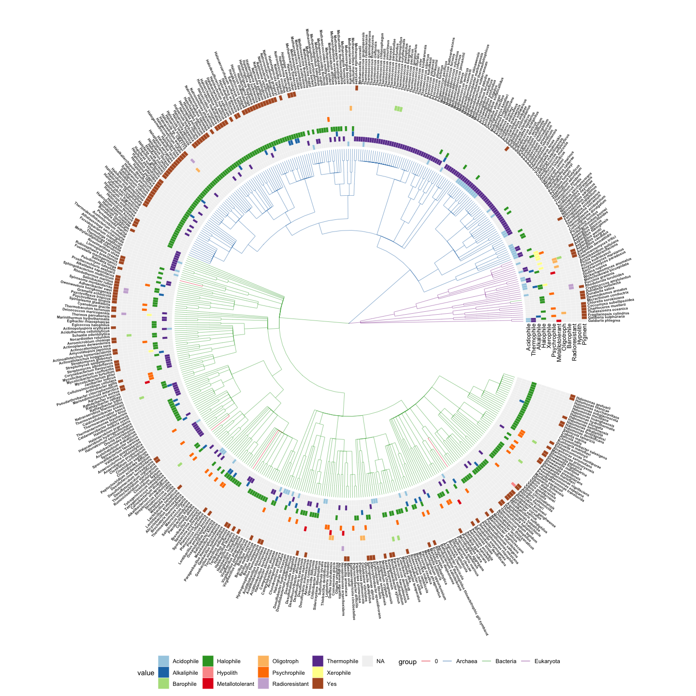<!-- -->

## Supplemental Figure 7

Purple Sulfur Bacteria (order Chromatiales) and Purple non-sulfur
Bacteria Rhodospirillaceae
family

``` r
psb=readLines("Chromatiales.txt")
species_data$Species= sub("_", " ", species_data$Species)
species_data$Species=str_trim(species_data$Species)
purple_bac=species_data[species_data$Species %in% psb,]
purple_bac$Abundance=as.numeric(purple_bac$Abundance)

ggplot(purple_bac, aes(x=Species, y=Abundance, fill=Type)) +
  geom_bar(stat="identity")+ theme_bw() + facet_grid(~Type) + xlab("Species") + ylab("No. of Reads") + coord_flip()+
  ggtitle("Purple Sulfur Bacteria ") + theme_bw()+ 
  scale_fill_manual(values=c("pink2","violetred1","mediumvioletred" ,"violetred4")) 
```

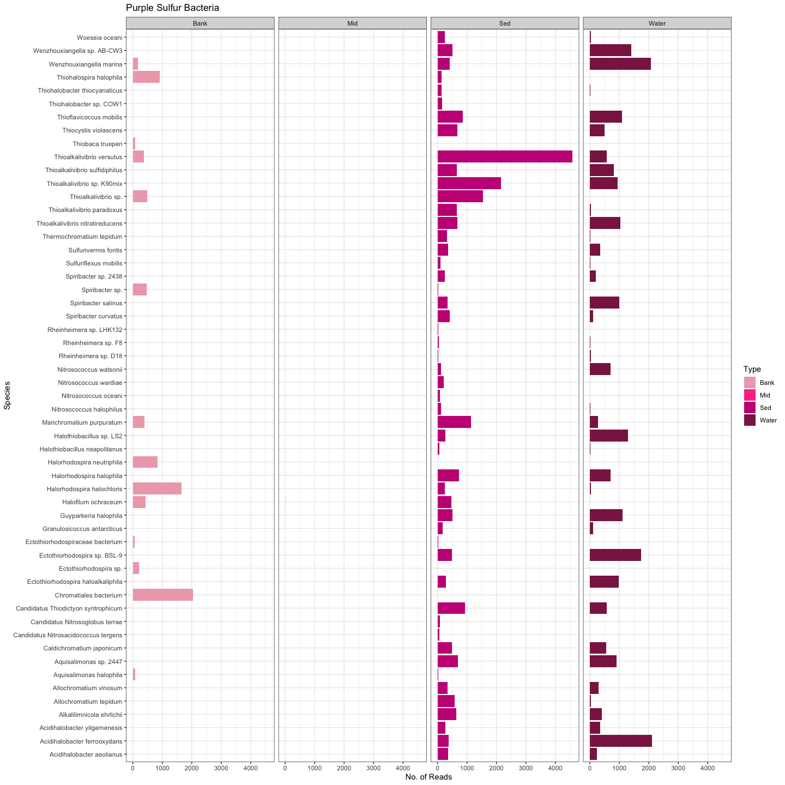<!-- -->

``` r
#Plot purple non-sulfur bacteria (Belong to Rhodospirillaceae family)
nonpsb=readLines("Rhodospirillaceae.txt")
non_purple_bac=species_data[species_data$Species %in% nonpsb,]
non_purple_bac$Abundance=as.numeric(non_purple_bac$Abundance)

ggplot(non_purple_bac, aes(x=Species, y=Abundance, fill=Type)) +
  geom_bar(stat="identity")+ theme_bw() + facet_grid(~Type) + xlab("Species") + ylab("No. of Reads") + coord_flip()+
  ggtitle("Purple Non-Sulfur Bacteria ") + theme_bw()+ 
  scale_fill_manual(values=c("pink2","violetred1","mediumvioletred" ,"violetred4")) 
```

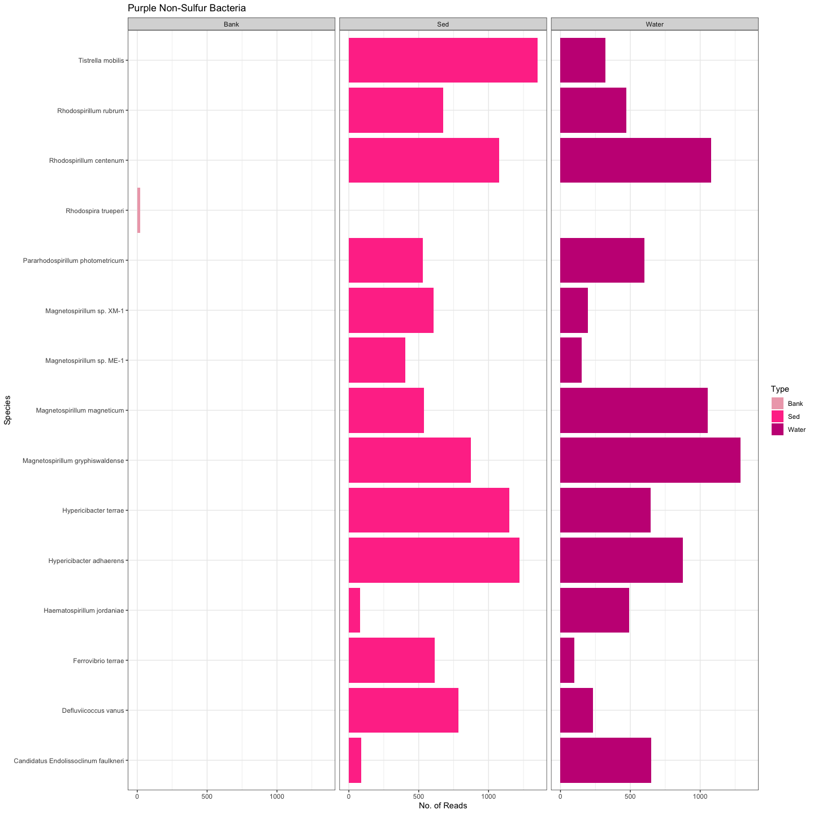<!-- -->

## Figure 5B

Frequency of pathways by
taxa

``` r
path=read.csv("Pathway_by_sp.csv")
path_clean = path[!(path$Species== ""), ]
path_clean=dplyr::select(path_clean, Pathway, Species, Count, Sample)
path_clean$Pathway=as.factor(path_clean$Pathway)
path_clean_DS=path_clean[path_clean$Sample=="DS",]
path_clean_DS=path_clean_DS[apply(path_clean_DS!=0, 1, all),]
path_clean_FW=path_clean[path_clean$Sample=="FW",]
path_clean_FW=path_clean_FW[apply(path_clean_FW!=0, 1, all),]

DS_path_count=count(path_clean_DS$Species)
colnames(DS_path_count)=c("Species", "DS")
FW_path_count=count(path_clean_FW$Species)
colnames(FW_path_count)=c("Species", "FW")
all_counts_path_species=full_join(DS_path_count, FW_path_count)
```

    ## Joining, by = "Species"

``` r
all_counts_path_species[is.na(all_counts_path_species)] = 0
all_counts_path_species$Species= sub("s__", "",all_counts_path_species$Species)
rownames(all_counts_path_species)=all_counts_path_species$Species
all_counts_path_species=all_counts_path_species[,-1]
col.pal <- RColorBrewer::brewer.pal(9, "Reds")

pheatmap(all_counts_path_species, cluster_cols = F , color = col.pal, fontsize =18, display_numbers = all_counts_path_species)
```

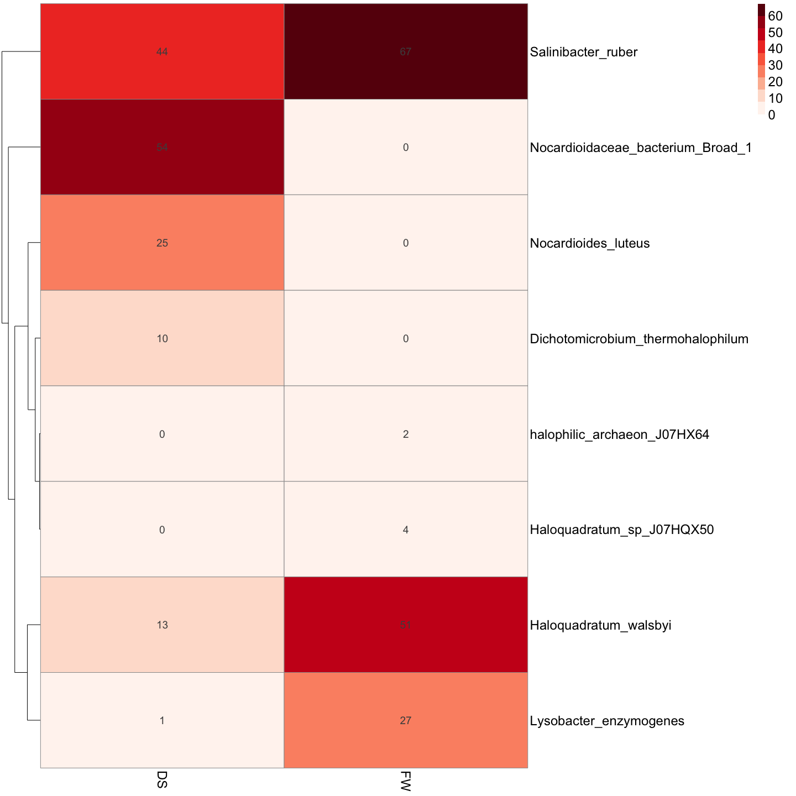<!-- -->

## Figure 3-4

Phylum diversity by each sequencing method

``` r
g18s_plot=plot_bar(hillier_phylo_18S, fill="Phylum")
g18s_plot_data=as.data.frame(g18s_plot$data)

g16s_plot=plot_bar(hillier_phylo_16s, fill="Phylum")
g16s_plot_data=as.data.frame(g16s_plot$data)

merged_data_amplicon_phylum=rbind(g16s_plot_data,g18s_plot_data) #merge 18s and 16s dataframes
merged_data_amplicon_phylum_filtered=dplyr::select(merged_data_amplicon_phylum, Abundance, Domain, Phylum, Type, Target ) #Select columns of interes
merged_data_amplicon_phylum_filtered=merged_data_amplicon_phylum_filtered[!(is.na(merged_data_amplicon_phylum_filtered$Phylum)),]

merged_data_amplicon_phylum_summarized=merged_data_amplicon_phylum_filtered %>%
  group_by(Domain, Phylum, Type, Target) %>% 
  summarise_each(funs(sum))  #Merge by Domain adding abundances

merged_data_amplicon_phylum_summarized_clean=lapply(as.data.frame(merged_data_amplicon_phylum_summarized), function(x) sub("d__", "", x)) #Clean domain/phylum names
merged_data_amplicon_phylum_summarized_clean=as.data.frame(lapply(as.data.frame(merged_data_amplicon_phylum_summarized_clean), function(x) sub("p__", "", x))) #Clean domain/phylum names


data_phylum_amplicon_filtered= merged_data_amplicon_phylum_summarized_clean[merged_data_amplicon_phylum_summarized_clean$Domain !="Unassigned",]
data_phylum_amplicon_filtered_na= data_phylum_amplicon_filtered[data_phylum_amplicon_filtered$Abundance !="0",]

#Ready amplicon data. Now we need to sum phylum from wgs and merge

DSF3_phylum=DSF3[DSF3$rank=="P",] #Select phylum level for WGS data
DSF3_phylum$Type= "Sed" #Include type of sample column
FWF3_phylum=FWF3[FWF3$rank=="P",]
FWF3_phylum$Type= "Water"

merged_data_phylum_wgs=rbind(FWF3_phylum,DSF3_phylum)
merged_data_phylum_wgs_select=dplyr::select(merged_data_phylum_wgs, Taxon, TaxonName, Reads, Type)
merged_data_phylum_wgs_select$Taxon= gsub("\\|.*", "",merged_data_phylum_wgs_select$Taxon)
merged_data_phylum_wgs_select$Taxon= sub("d__", "",merged_data_phylum_wgs_select$Taxon)


merged_data_phylum_wgs_select$Target="WGS"
colnames(merged_data_phylum_wgs_select)=c("Domain","Phylum", "Abundance", "Type", "Target")
phylum_data=rbind(data_phylum_amplicon_filtered_na, merged_data_phylum_wgs_select)

#Rename according to synonyms 
phylum_data$Phylum= sub("Candidatus ", "",phylum_data$Phylum)
phylum_data$Phylum= sub("Hadarchaeota", "Candidatus Hadarchaeum",phylum_data$Phylum) #Hadarchaeota does not exit on NCBI
phylum_data$Phylum= sub("Micrarchaeota", "Candidatus Micrarchaeota",phylum_data$Phylum) #Micrarchaeota does not exit on NCBI
phylum_data$Phylum= sub("Nanohaloarchaeota", "Candidatus Nanohaloarchaeota",phylum_data$Phylum) #Nanohaloarchaeota does not exit on NCBI
phylum_data$Phylum= sub("Thermoplasmatota", "Candidatus Thermoplasmatota",phylum_data$Phylum) #Thermoplasmatota does not exit on NCBI
phylum_data$Phylum= sub("Korarchaeota", "Candidatus Korarchaeota",phylum_data$Phylum) #Korarchaeota does not exit on NCBI
phylum_data$Phylum= sub("Aenigmarchaeota", "Candidatus Aenigmarchaeota",phylum_data$Phylum) #Aenigmarchaeota does not exit on NCBI
phylum_data$Phylum= sub("Lokiarchaeota", "Candidatus Lokiarchaeota",phylum_data$Phylum) #Lokiarchaeota does not exit on NCBI
phylum_data$Phylum= sub("Altiarchaeota", "Candidatus Altiarchaeota",phylum_data$Phylum)

phylum_data$Abundance=as.numeric(phylum_data$Abundance)
phylum_data$Scale = scale(phylum_data$Abundance) #Scale data
phylum_data$Norm <- (phylum_data$Abundance - min(phylum_data$Abundance)) / (max(phylum_data$Abundance) - min(phylum_data$Abundance))
phylum_data$log <- log(phylum_data$Abundance)

phylum_data$Phylum=str_trim(phylum_data$Phylum)

phylum_data$Target <- factor(phylum_data$Target,      # Reordering group factor levels
                             levels = c("16S", "A2F", "18S", "WGS"))
phylum_data$Type=as.factor(phylum_data$Type)


#Archaea
my_reds = brewer.pal(n = 9, "Reds")[3:9] 
ggplot(phylum_data[phylum_data$Domain=="Archaea",], aes(x= Type, y= Phylum))+geom_point(aes(color= Type, size=log)) + facet_grid(~Target,scales = "free_x")  + 
  scale_size(range = c(5,15))  + scale_color_manual(values=my_reds) + theme_bw()
```

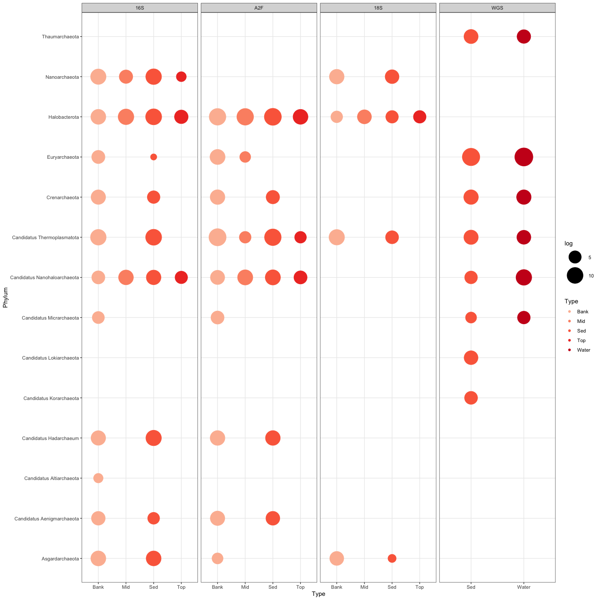<!-- -->

``` r
#Bacteria
my_blues = brewer.pal(n = 9, "Blues")[3:9] 
ggplot(phylum_data[phylum_data$Domain=="Bacteria",], aes(x= Type, y= Phylum))+geom_point(aes(color= Type, size=log)) + facet_grid(~Target,scales = "free_x")  + 
  scale_size(range = c(5,15))  + scale_color_manual(values=my_blues) + theme_bw()
```

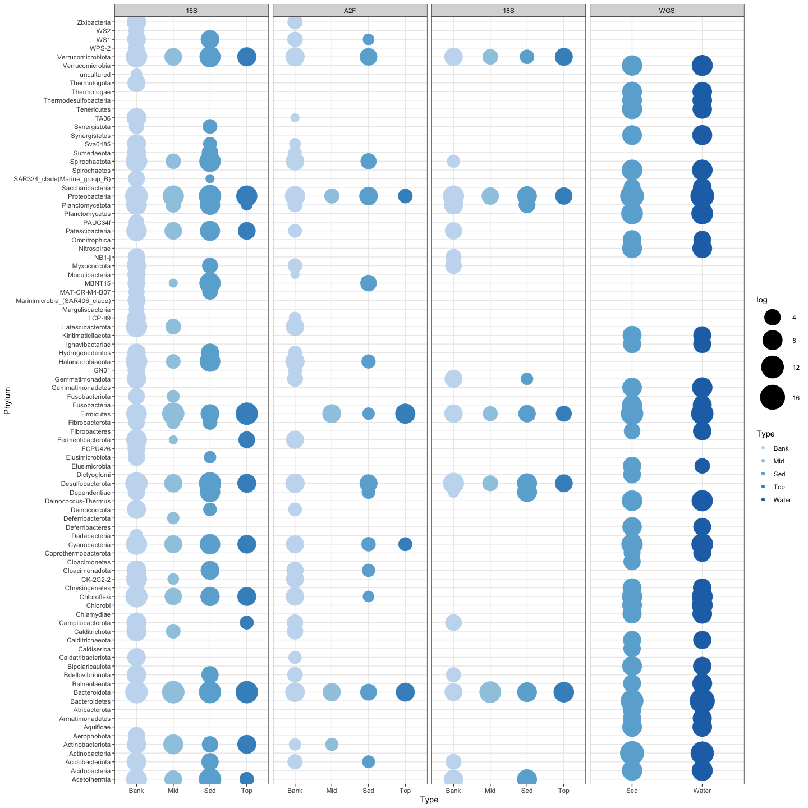<!-- -->

``` r
#Eukarya
my_greens = brewer.pal(n = 9, "Greens")[3:9] 
ggplot(phylum_data[phylum_data$Domain=="Eukaryota",], aes(x= Type, y= Phylum))+geom_point(aes(color= Type, size=log)) + facet_grid(~Target,scales = "free_x")  + 
  scale_size(range = c(5,20))  + scale_color_manual(values=my_greens) + theme_bw()
```

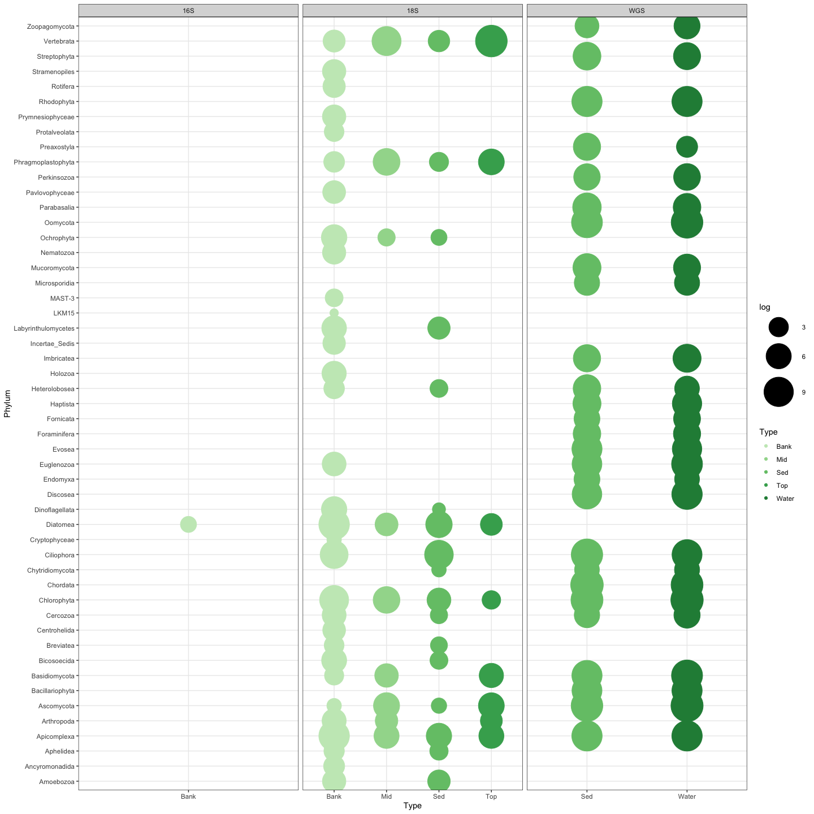<!-- -->

``` r
#virus
my_purple = brewer.pal(n = 9, "Purples")[c(4,9)] 
ggplot(phylum_data[phylum_data$Domain=="Viruses",], aes(x= Type, y= Phylum))+geom_point(aes(color= Type, size=log)) + facet_grid(~Target,scales = "free_x")  + 
  scale_size(range = c(5,20))  + scale_color_manual(values=my_purple) + theme_bw()
```

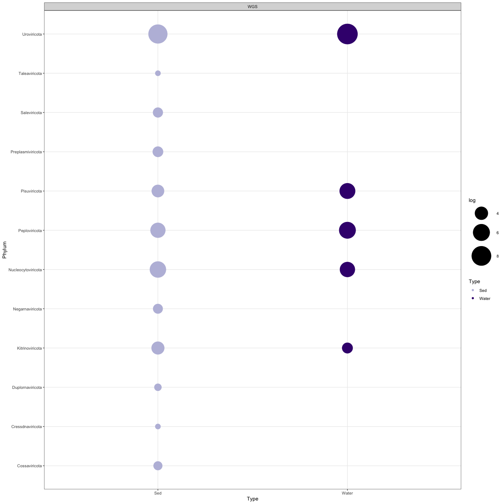<!-- -->

## Supplemental Figure 4

Top 20 species of each domain in amplicon and WGS

``` r
#top amplicon archaea
species_data_arch=species_data[species_data$Domain=="Archaea",]
species_data_arch$Species= sub(" ", "_", str_trim(species_data_arch$Species))
species_data_arch$Target=sub("16S|18S|A2F", "Amplicon",  species_data_arch$Target)
species_data_arch_filtered=dplyr::select(species_data_arch, Species, Target, Abundance)
species_data_arch_filtered$Abundance=as.numeric(species_data_arch_filtered$Abundance)

species_arch_pres=xtabs(Abundance~Species+Target, species_data_arch_filtered)
species_arch_pres_matrix=as.data.frame.matrix(species_arch_pres)

top_20_species_arch_sorted=species_arch_pres_matrix[order(species_arch_pres_matrix[["Amplicon"]], decreasing = TRUE),][1:20,]
top_20_species_arch_sorted$Species=rownames(top_20_species_arch_sorted)

top_archaea_ampl=ggplot(data=top_20_species_arch_sorted, aes(x=reorder(Species, -Amplicon), y=Amplicon)) +
  geom_bar(stat="identity", width=0.5, fill="#F7C25E")+ coord_flip() + theme_bw() + xlab("Species") + ylab("No. of Reads") + ggtitle("Archaea-Amplicon")

#top wgs archaea
top_20_species_arch_sorted=species_arch_pres_matrix[order(species_arch_pres_matrix[["WGS"]], decreasing = TRUE),][1:20,]
top_20_species_arch_sorted$Species=rownames(top_20_species_arch_sorted)
top_archaea_wgs=ggplot(data=top_20_species_arch_sorted, aes(x=reorder(Species, -WGS), y=WGS)) +
  geom_bar(stat="identity", width=0.5, fill="#f1cc4b")+ coord_flip() + theme_bw() + xlab("Species") + ylab("No. of Reads") + ggtitle("Archaea-WGS")

#Top bacteria
#species_bacteria_pres_matrix
species_bacteria_sorted=species_bacteria_pres_matrix[order(species_bacteria_pres_matrix[["WGS"]], decreasing = TRUE),][1:20,]
species_bacteria_sorted$Species=rownames(species_bacteria_sorted)

top_bacteria_wgs=ggplot(data=species_bacteria_sorted, aes(x=reorder(Species, -WGS), y=WGS)) +
  geom_bar(stat="identity", width=0.5, fill="deepskyblue3")+ coord_flip() + theme_bw() + xlab("Species") + ylab("No. of Reads") + ggtitle("Bacteria-WGS")

species_bacteria_sorted=species_bacteria_pres_matrix[order(species_bacteria_pres_matrix[["Amplicon"]], decreasing = TRUE),][1:20,]
species_bacteria_sorted$Species=rownames(species_bacteria_sorted)

top_bacteria_ampl=ggplot(data=species_bacteria_sorted, aes(x=reorder(Species, -Amplicon), y=Amplicon)) +
  geom_bar(stat="identity", width=0.5, fill="lightskyblue1")+ coord_flip() + theme_bw() + xlab("Species") + ylab("No. of Reads") + ggtitle("Bacteria-Amplicon")

#Eukaryotes
species_data_euk=species_data[species_data$Domain=="Eukaryota",] #Trim eukaryotes
species_data_euk$Species= sub(" ", "_", str_trim(species_data_euk$Species)) #Clean names
species_data_euk$Target=sub("16S|18S|A2F", "Amplicon",  species_data_euk$Target) #Merge amplicon genes on a single "amplicon" category

species_data_euk_filtered=dplyr::select(species_data_euk, Species, Target, Abundance)
species_data_euk_filtered$Abundance=as.numeric(species_data_euk_filtered$Abundance)
species_data_euk_filtered$Target=as.factor(species_data_euk_filtered$Target)

species_euk_pres=xtabs(Abundance~Species+Target, species_data_euk_filtered) #Construct frequency table
species_euk_pres_matrix=as.data.frame.matrix(species_euk_pres)
species_euk_pres_matrix$Species=rownames(species_euk_pres_matrix)

#Euk WGS
species_euk_sorted=species_euk_pres_matrix[order(species_euk_pres_matrix[["WGS"]], decreasing = TRUE),][1:20,]
top_euk_wgs=ggplot(data=species_euk_sorted, aes(x=reorder(Species, -WGS), y=WGS)) +
  geom_bar(stat="identity", width=0.5, fill="#AFE185")+ coord_flip() + theme_bw() + xlab("Species") + ylab("No. of Reads")+ ggtitle("Eukaryotes-WGS")

#Euk Amplicon
species_euk_sorted=species_euk_pres_matrix[order(species_euk_pres_matrix[["Amplicon"]], decreasing = TRUE),][1:20,]
top_euk_ampl=ggplot(data=species_euk_sorted, aes(x=reorder(Species, -Amplicon), y=Amplicon)) +
  geom_bar(stat="identity", width=0.5, fill="#69874f")+ coord_flip() + theme_bw() + xlab("Species") + ylab("No. of Reads")+ ggtitle("Eukaryotes-Amplicon")

#Viruses
species_data_virus=species_data[species_data$Domain=="Viruses",] #Trim eukaryotes
species_data_virus$Species= sub(" ", "_", str_trim(species_data_virus$Species)) #Clean names
species_data_virus$Target=as.factor(species_data_virus$Target)
species_data_virus$Type=as.factor(species_data_virus$Type)
species_data_virus$Abundance=as.numeric(species_data_virus$Abundance)

species_data_virus_filtered=dplyr::select(species_data_virus, Species, Target, Abundance)

species_virus_pres=xtabs(Abundance~Species+Target, species_data_virus_filtered) #Construct frequency table
species_virus_pres_matrix=as.data.frame.matrix(species_virus_pres)
species_virus_pres_matrix$Species=rownames(species_virus_pres_matrix)

species_virus_sorted=species_virus_pres_matrix[order(species_virus_pres_matrix[["WGS"]], decreasing = TRUE),][1:20,]

top_virus=ggplot(data=species_virus_sorted, aes(x=reorder(Species, -WGS), y=WGS)) +
  geom_bar(stat="identity", width=0.5, fill="red3")+ coord_flip() + theme_bw() + xlab("Species") + ylab("No. of Reads")+ ggtitle("Virus-WGS")


figure <- ggarrange(top_bacteria_ampl, top_bacteria_wgs, top_archaea_ampl, top_archaea_wgs,
                    top_euk_ampl,top_euk_wgs,
                    top_virus,
                    labels = c("A", "B", "C", "D", "E", "F", "G"),
                    ncol = 2, nrow = 4,align = "hv")
top_bacteria_ampl
```

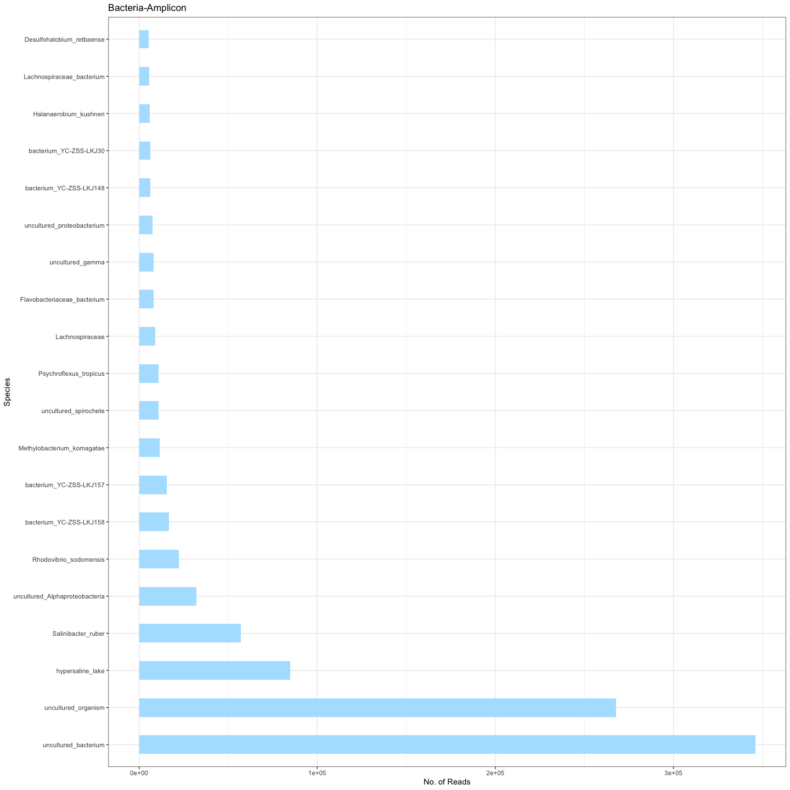<!-- -->

``` r
top_bacteria_wgs
```

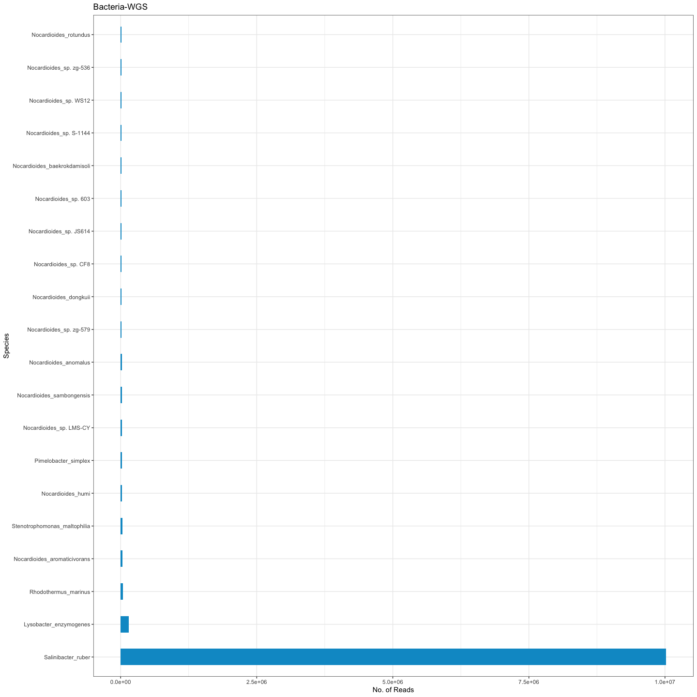<!-- -->

``` r
top_archaea_ampl
```

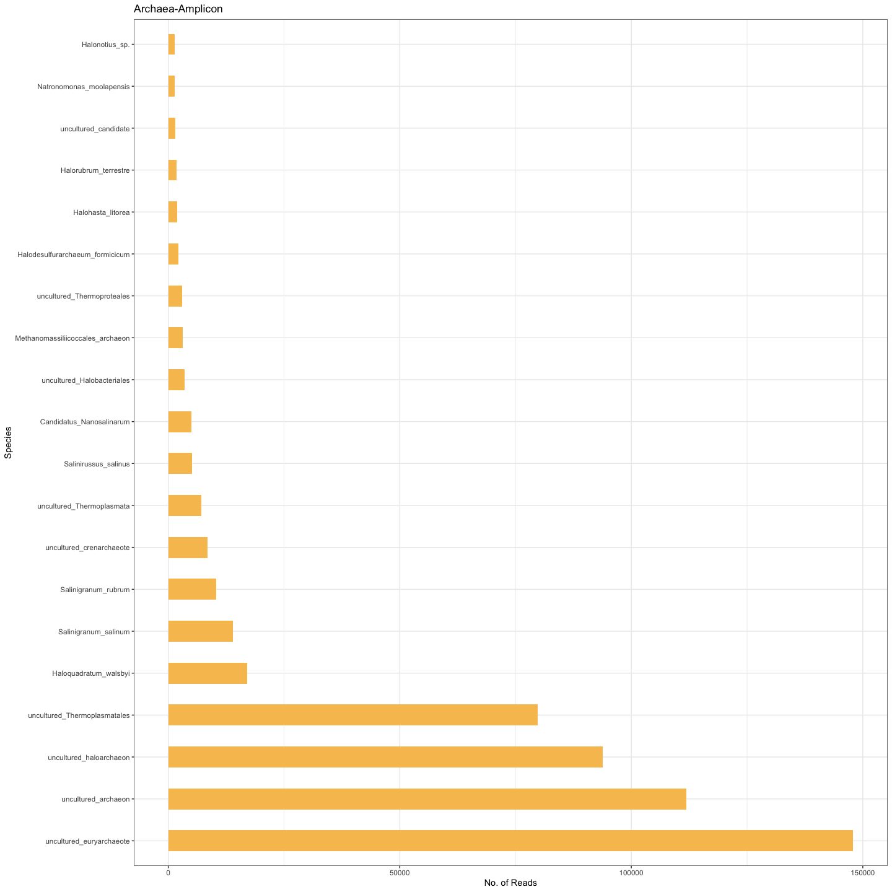<!-- -->

``` r
top_archaea_wgs
```

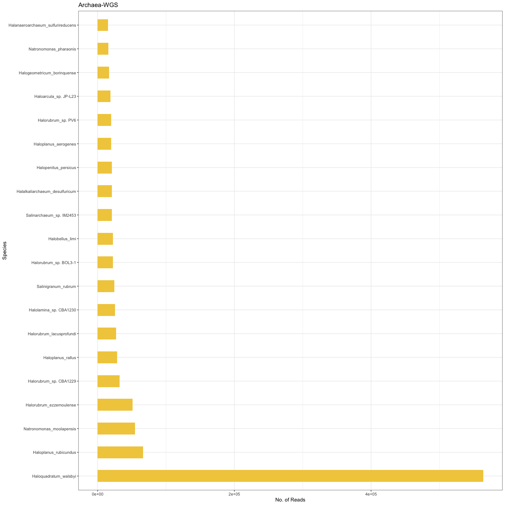<!-- -->

``` r
top_euk_ampl
```

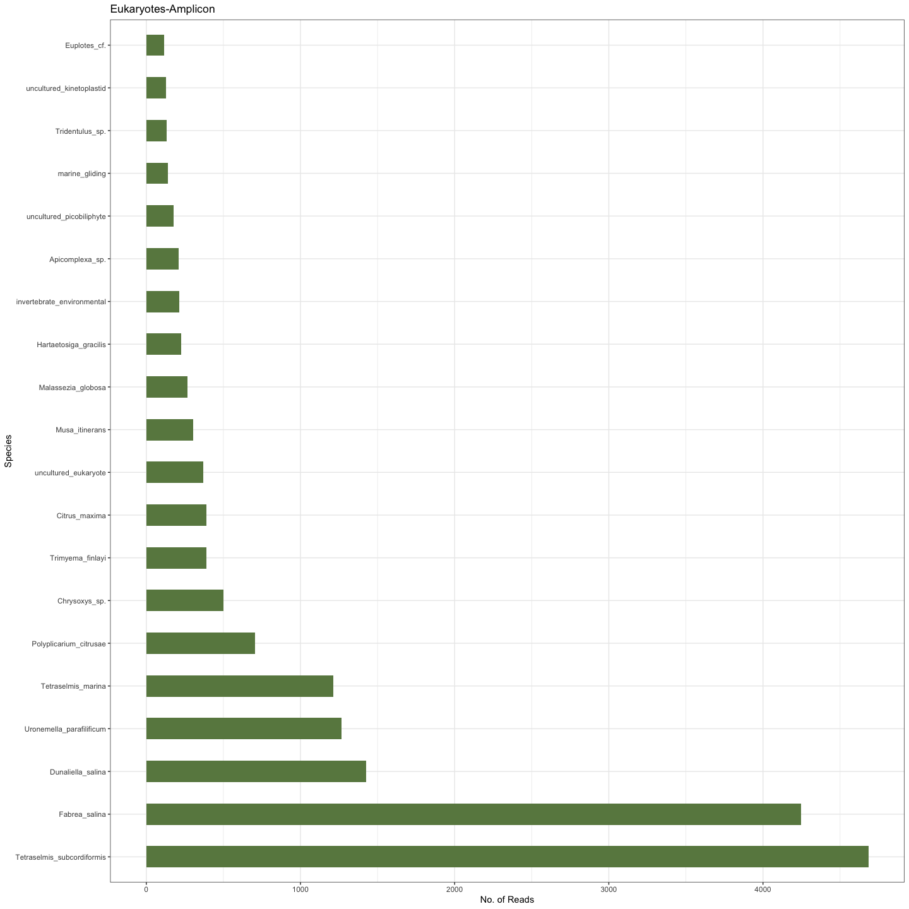<!-- -->

``` r
top_euk_wgs
```

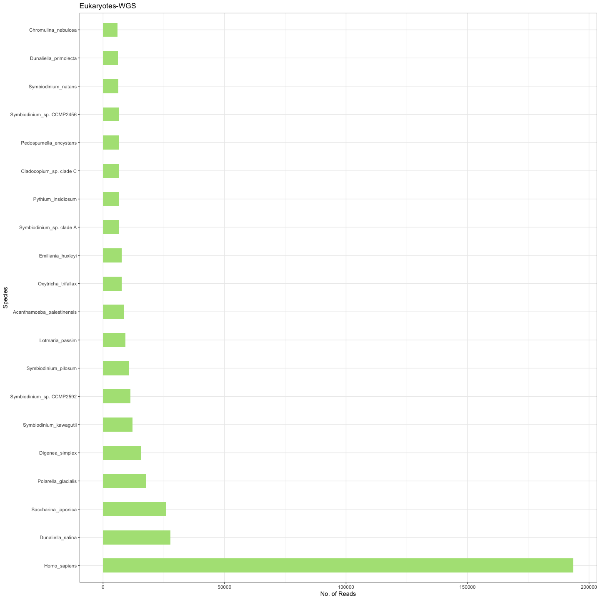<!-- -->

``` r
top_virus
```

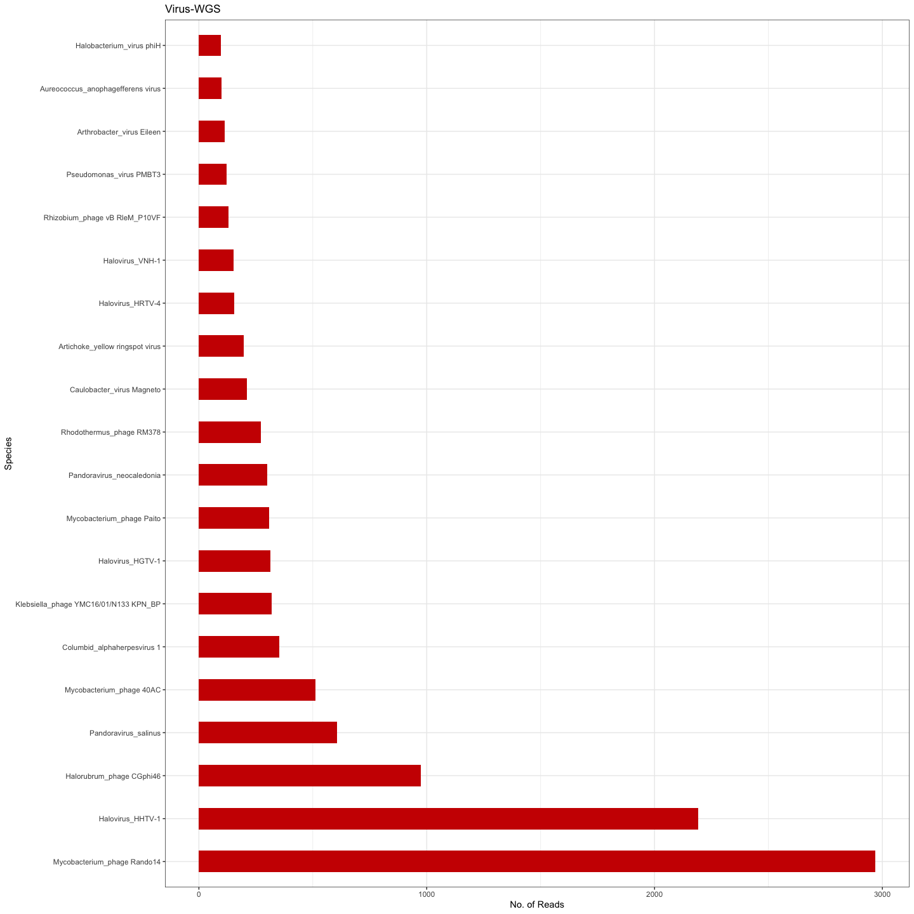<!-- -->

## Figure 2E

Culture isolates Maximum Likelihood
tree

``` r
ml_tree=read.tree("ML_Hillier_isolates.txt") #Import ML tree IQ-tree
ml_tree$tip.label<-gsub("_"," ",ml_tree$tip.label)
ggtree(ml_tree, size=0.1, branch.length = "none")+ geom_tiplab(size=1.8, font="bold", linesize = 0.1, offset = 0.1, color="gray20") + 
  geom_nodelab(size=1.8, color="gray30")+ geom_treescale()+ xlim(NA,40)
```

    ## Found more than one class "phylo" in cache; using the first, from namespace 'phyloseq'

    ## Also defined by 'tidytree'

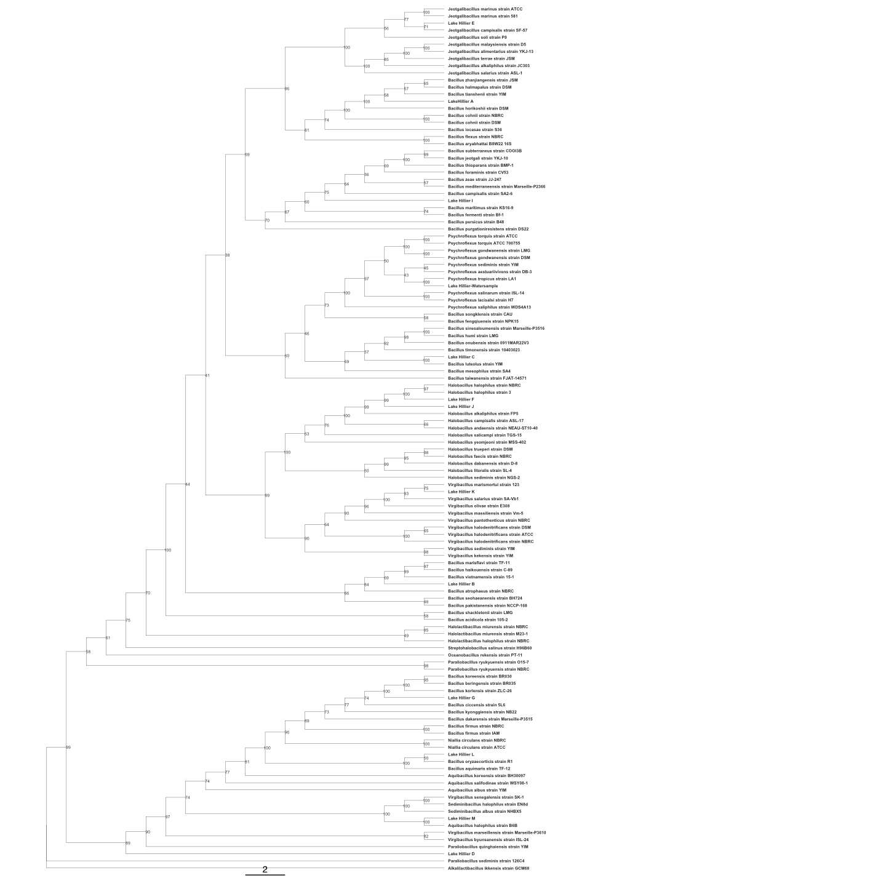<!-- -->
